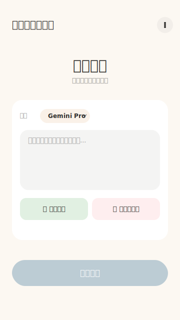
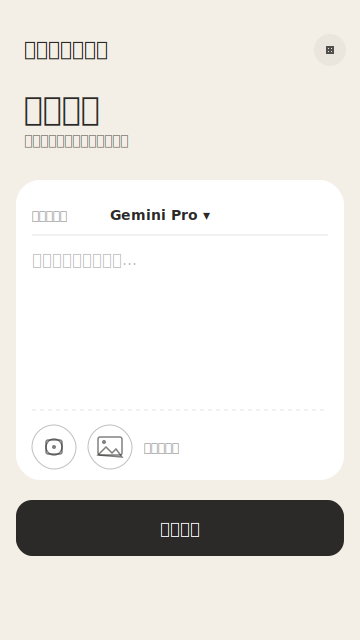

# Japanese Grammar App

Android app for Japanese grammar analysis, OCR-assisted text capture, bookmarks, history, flashcards, and configurable LLM/TTS providers.

[Download the latest APK](https://github.com/m1kuk1m/JapaneseGrammarApp/releases/latest)

## Preview




## Tech Stack

- Kotlin and Jetpack Compose
- Hilt dependency injection
- Room database with schema exports
- Retrofit/OkHttp networking
- ML Kit OCR and ONNX Runtime for local text region detection

## Requirements

- Android Studio with JDK 17
- Android SDK 34
- Gradle wrapper included in this repository

## Build

```powershell
.\gradlew.bat assembleDebug
```

Run unit tests:

```powershell
.\gradlew.bat testDebugUnitTest
```

On macOS or Linux:

```bash
./gradlew testDebugUnitTest
```

## Release Signing

Release signing values are intentionally kept out of Git. Configure them locally through `local.properties`, Gradle properties, or environment variables:

```properties
RELEASE_STORE_FILE=release.jks
RELEASE_STORE_PASSWORD=your-store-password
RELEASE_KEY_ALIAS=your-key-alias
RELEASE_KEY_PASSWORD=your-key-password
```

The keystore file and release APKs should stay local. Publish built APKs through GitHub Releases or another distribution channel instead of committing them to source control.

For GitHub Actions release builds, configure these repository secrets:

```text
RELEASE_KEYSTORE_BASE64
RELEASE_STORE_PASSWORD
RELEASE_KEY_ALIAS
RELEASE_KEY_PASSWORD
```

Create `RELEASE_KEYSTORE_BASE64` locally from your keystore:

```powershell
[Convert]::ToBase64String([IO.File]::ReadAllBytes("release.jks")) | Set-Clipboard
```

Then push a version tag such as `v1.0.1` to let the release workflow build and attach an APK automatically.

## Versioning

- Keep `versionName` aligned with GitHub release tags, for example `1.0.1` and `v1.0.1`.
- Increase `versionCode` before publishing an APK that should upgrade an installed copy.
- The current package name is `com.example.japanesegrammarapp`. Keep it unchanged for compatibility with existing installs; consider a permanent package name before a broader public release.

## Notes

- API keys are entered in app settings and stored locally on the device.
- `local.properties`, signing keys, APKs, IDE state, prompt backups, and temporary scrape/search files are ignored by Git.
- The bundled OCR model under `app/src/main/assets/ocr/rapidocr/` is required for the RapidOCR text region detector.
- See [THIRD_PARTY_NOTICES.md](THIRD_PARTY_NOTICES.md) before redistributing builds that include the bundled OCR model.
