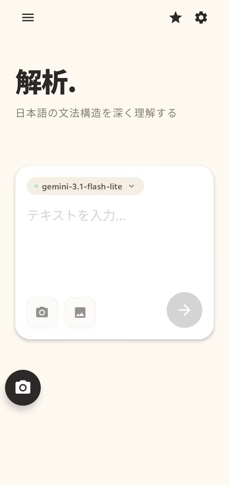
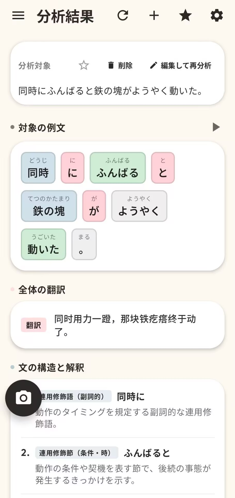

# Japanese Grammar App

<p align="center">
  <a href="https://github.com/m1kuk1m/JapaneseGrammarApp/actions/workflows/ci.yml">
    
  </a>
  <a href="https://opensource.org/licenses/Apache-2.0">
    
  </a>
  <a href="https://kotlinlang.org">
    
  </a>
  <a href="https://developer.android.com">
    
  </a>
</p>

Japanese Grammar App is a modern, developer-friendly Android utility designed to help users analyze Japanese sentences. Utilizing OCR text capture and configurable Large Language Models (LLMs), the application parses complex sentences into grammar-focused explanations, making Japanese study more interactive and efficient.

---

## Preview

<p align="center">
  
  
</p>

---

## Features

* **Advanced Grammar Analysis**: Breaks down Japanese sentences, providing detailed lexical, syntactic, and grammatical breakdowns.
* **OCR-Assisted Text Capture**: Capture Japanese text directly using the device camera or local image inputs.
* **Customizable OCR Region Tuning**: Calibrate text-region detection boundaries for horizontal, vertical, or complex layouts.
* **Local Storage & History**: Keep a persistent history of analyzed sentences locally on your device.
* **Bookmarks & Flashcards**: Bookmark specific sentences or segments and review them using an interactive flashcard system.
* **Configurable LLM & TTS Providers**: Set up custom LLM endpoints (e.g., Gemini, OpenAI, Claude) and Text-to-Speech (TTS) backends directly within the settings.

---

## Security & Privacy

We prioritize user security and credential privacy:
* **Encrypted Shared Preferences**: All API keys and credentials are encrypted using `EncryptedSharedPreferences` at the OS level, keeping them secure from other apps or root access.
* **No Middleman Servers**: The app communicates directly from your device to your configured LLM/TTS provider's API. No intermediate servers store your credentials or analytics.
* **Offline-First Storage**: Sentence analysis history, bookmarks, and flashcards are stored in a secure local Room database.

---

## Tech Stack

* **UI Layer**: Jetpack Compose (1.5.4) using Material 3 design tokens.
* **Dependency Injection**: Hilt (2.48) for clean architecture decoupling.
* **Local Database**: Room (2.6.1) with SQLite backend, schema migrations, and Paging 3 integrations.
* **Networking**: Retrofit (2.9.0) and OkHttp logging interceptors.
* **Text Recognition (OCR)**: Google ML Kit Japanese Text Recognition.
* **Text Region Detection**: ONNX Runtime Android (1.18.0) running a bundled local PP-OCRv4 detection model.
* **Image Loading**: Coil Compose for memory-efficient bitmap rendering.

---

## For Developers

### Prerequisites
* Android Studio (latest stable version)
* JDK 17
* Android SDK 34 (API Level 34)

### Building the Project
Clone the repository and build the debug APK using the included Gradle wrapper:

**Windows (PowerShell)**:
```powershell
.\gradlew.bat assembleDebug
```

**macOS / Linux**:
```bash
chmod +x gradlew
./gradlew assembleDebug
```

### Running Tests
To run unit tests across all repositories, view models, and use cases:

**Windows (PowerShell)**:
```powershell
.\gradlew.bat testDebugUnitTest
```

**macOS / Linux**:
```bash
./gradlew testDebugUnitTest
```

---

## Release Signing

To sign release builds, signing keys should never be committed to source control. You can configure release signing locally by adding the following keys to your local configuration (e.g., `local.properties` or environment variables):

```properties
RELEASE_STORE_FILE=release.jks
RELEASE_STORE_PASSWORD=your_keystore_password
RELEASE_KEY_ALIAS=your_key_alias
RELEASE_KEY_PASSWORD=your_key_password
```

For automated deployments, the included GitHub Actions release workflow builds and signs APK assets using base64 encoded secrets.

---

## Third-Party Notices

The local OCR detector utilizes the PP-OCRv4 model. For licenses and upstream source details regarding bundled ONNX models, please refer to [THIRD_PARTY_NOTICES.md](THIRD_PARTY_NOTICES.md).

---

## License

This project is licensed under the Apache License, Version 2.0. See the [LICENSE](LICENSE) file for details.
