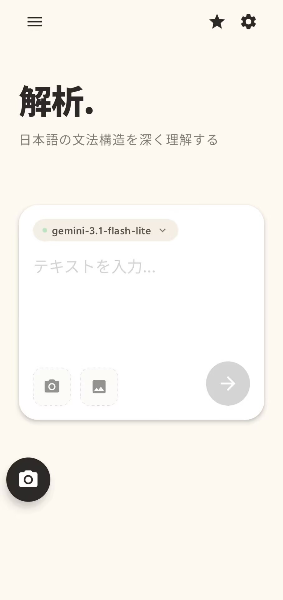
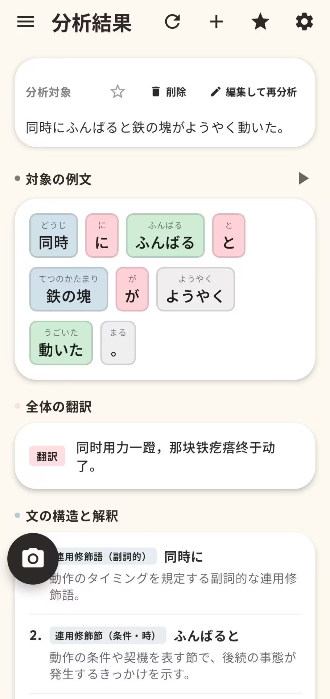

# YomiLLM

<p align="center">
  <a href="https://github.com/m1kuk1m/YomiLLM/actions/workflows/ci.yml">
    
  </a>
  <a href="https://opensource.org/licenses/Apache-2.0">
    
  </a>
  <a href="https://kotlinlang.org">
    
  </a>
  <a href="https://developer.android.com">
    
  </a>
</p>

An Android app for analyzing Japanese sentences. Capture text with the camera or from an image, and it breaks the sentence down into per-word grammar explanations using an LLM provider you configure yourself.

## Preview

<p align="center">
  
  
</p>

## Features

* **Grammar analysis** — splits a sentence into tokens and explains the lexical, syntactic, and grammatical role of each.
* **OCR text capture** — read Japanese text from the camera or a local image. Region detection handles horizontal and vertical layouts, and the detection boundaries are tunable if it gets a line wrong.
* **Bookmarks and flashcards** — save sentences, words, or grammar points, then review them as flashcards. Import/export supports JSON, CSV, and Anki-compatible TSV.
* **History** — analyzed sentences are kept locally, with full-text search.
* **Learning statistics** — daily through yearly activity, with charts and a heatmap.
* **Steam Deck Drop** — wirelessly receive in-game screenshots from Steam Deck over local Wi-Fi with zero-lag mDNS auto-discovery and token authentication. Works with the companion Decky Loader plugin [decky-yomi-sync](https://github.com/m1kuk1m/decky-yomi-sync).
* **Bring your own provider** — point it at Gemini, OpenAI, Claude, or any compatible endpoint. TTS backends are configurable too.

## Security & Privacy

How credentials and data are handled:

* **API keys** are stored via `EncryptedSharedPreferences` (AES256-SIV keys, AES256-GCM values), backed by a `MasterKey` in the Android Keystore. Note this protects against other apps and offline extraction, not against an attacker with root on the device. The underlying `androidx.security:security-crypto` dependency is currently on an alpha release (`1.1.0-alpha06`).
* **No middleman servers.** Requests go from your device straight to whichever LLM/TTS endpoint you configured. Nothing is proxied, and no credentials or analytics are collected.
* **Local storage.** History, bookmarks, and flashcards live in an on-device Room database.

## Tech Stack

* **UI** — Jetpack Compose (BOM 2024.02.00), Material 3, Navigation Compose
* **DI** — Hilt (2.48)
* **Database** — Room (2.6.1) with schema migrations and Paging 3
* **Networking** — Retrofit (2.9.0) with OkHttp (4.12.0); `okhttp-sse` for streaming responses
* **OCR** — Google ML Kit Japanese text recognition
* **Text region detection** — ONNX Runtime Android (1.18.0) running a bundled PP-OCRv4 detection model
* **Camera** — CameraX (1.3.1)
* **Charts** — Vico (1.13.0)
* **Image loading** — Coil (2.5.0)

## For Developers

### Prerequisites
* Android Studio (latest stable version)
* JDK 17
* Android SDK 34 (API Level 34)

### Building the Project
Clone the repository and build the debug APK using the included Gradle wrapper:

**Windows (PowerShell)**:
```powershell
.\gradlew.bat assembleDebug
```

**macOS / Linux**:
```bash
chmod +x gradlew
./gradlew assembleDebug
```

### Running Tests
To run unit tests across all repositories, view models, and use cases:

**Windows (PowerShell)**:
```powershell
.\gradlew.bat testDebugUnitTest
```

**macOS / Linux**:
```bash
./gradlew testDebugUnitTest
```

## Release Signing

To sign release builds, signing keys should never be committed to source control. You can configure release signing locally by adding the following keys to your local configuration (e.g., `local.properties` or environment variables):

```properties
RELEASE_STORE_FILE=release.jks
RELEASE_STORE_PASSWORD=your_keystore_password
RELEASE_KEY_ALIAS=your_key_alias
RELEASE_KEY_PASSWORD=your_key_password
```

For automated deployments, the included GitHub Actions release workflow builds and signs APK assets using base64 encoded secrets.

## Changelog

See [CHANGELOG.md](CHANGELOG.md) for the version history, or the [Releases page](https://github.com/m1kuk1m/YomiLLM/releases) for signed APKs with SHA256 checksums.

## Third-Party Notices

The local OCR detector uses the PP-OCRv4 model. See [THIRD_PARTY_NOTICES.md](THIRD_PARTY_NOTICES.md) for licenses and upstream sources of the bundled ONNX models.

## License

This project is licensed under the Apache License, Version 2.0. See the [LICENSE](LICENSE) file for details.
