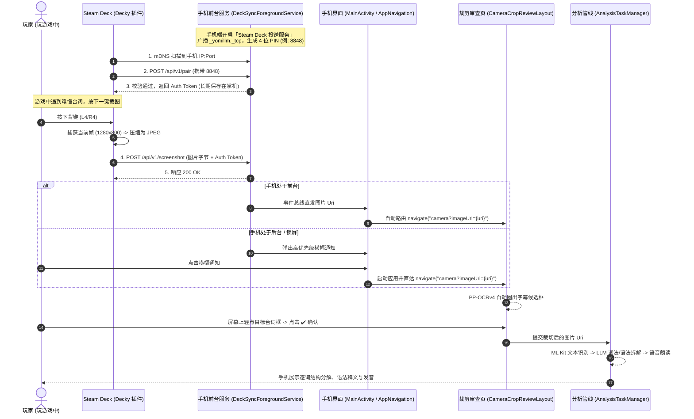

# Steam Deck 游戏截图无线同步与日文语法分析设计方案

> **项目名称**：YomiLLM Steam Deck Drop (Steam Deck 投送与自动分析)  
> **适用平台**：Steam Deck (SteamOS 3.x + Decky Loader) & Android (YomiLLM)  
> **设计版本**：v1.0.0  

---

## 目录
1. [项目背景与目标](#1-项目背景与目标)
2. [系统整体架构与数据流图](#2-系统整体架构与数据流图)
3. [Steam Deck 端设计 (Decky Loader 插件)](#3-steam-deck-端设计-decky-loader-插件)
4. [Android 手机端设计 (YomiLLM App)](#4-android-手机端设计-yomillm-app)
5. [通信协议与 API 规范](#5-通信协议与-api-规范)
6. [代码变更与新增清单](#6-代码变更与新增清单)
7. [常见问题与避坑指南](#7-常见问题与避坑指南)
8. [验证与联调方案](#8-验证与联调方案)

---

## 1. 项目背景与目标

在 Steam Deck 上游玩原汁原味的日文游戏（如 JRPG、视觉小说、动作冒险等）时，常常遇到生僻单词或复杂长难句。传统的查词方式需要玩家放下掌机、打开手机打字输入或拍照，极度打断游戏沉浸感。

本方案旨在打通 **Steam Deck 掌机** 与 **YomiLLM 手机应用** 之间的无线链路：
* **单键极速触发**：在 Steam Deck 游戏中按下背键（L4/R4）或快捷键，掌机在几十毫秒内静默捕获当前画面并通过局域网推送到手机。
* **智能唤起与高亮**：手机收到截图后无缝唤起裁剪审查页面，借助内置的 `ch_PP-OCRv4` ONNX 深度学习模型自动圈出游戏字幕框，玩家轻点即可选定台词。
* **原生标准流水线**：确认后自动完成 ML Kit 日文识别、LLM 逐词词性拆解、语法点释义与 TTS 发音，将手机打造为 Steam Deck 的即时日文同传“副屏”。

---

## 2. 系统整体架构与数据流图

### 2.1 架构概览

```mermaid
graph TD
    subgraph "Steam Deck (SteamOS 3.x / Gaming Mode)"
        A[运行日文游戏] -->|按下快捷键 L4/R4| B[Decky 插件: YomiDeck]
        B -->|方案1: 监听 Steam 截图文件夹<br/>方案2: 显存抓取| C[Python 后台守护进程]
        C -->|1. mDNS 自动发现设备<br/>2. 携带 PIN 码鉴权| D[局域网 HTTP POST 传输]
    end

    subgraph "Wi-Fi / 手机热点局域网 (<100ms 极低延迟)"
        D
    end

    subgraph "Android Phone (YomiLLM)"
        D --> E[DeckSyncForegroundService<br/>(Ktor 嵌入式 HTTP 服务 + NsdManager)]
        E -->|写入本地临时缓存| F{App 前后台状态判断}
        
        F -->|App 在前台| G1[直接内部导航<br/>CameraCropReviewLayout]
        F -->|App 在后台/锁屏| G2[高优先级横幅通知<br/>点击拉起直达裁剪页]
        
        G1 & G2 --> H[PP-OCRv4 文本区域检测<br/>自动高亮日文台词框]
        H -->|玩家轻点字幕框并确认| I[原有标准流水线<br/>ML Kit OCR -> LLM Analysis -> TTS]
        I --> J[结果呈现与历史记录归档]
    end
```

### 2.2 详细交互时序图



---

## 3. Steam Deck 端设计 (Decky Loader 插件)

### 3.1 插件目录结构
```text
decky-yomi-sync/
├── plugin.json              # 插件元数据（名称、版本、权限、图标）
├── package.json             # 前端依赖与构建脚本
├── src/
│   └── index.tsx            # Steam QAM 侧边栏面板 (React + TypeScript)
└── py_modules/
    ├── main.py              # Python 后台守护进程
    └── zeroconf_helper.py   # mDNS 局域网设备扫描封装
```

### 3.2 截屏捕获与发送逻辑
优先采用 **Steam 截图目录监听方案**（零侵入、高兼容、抗 SteamOS 大版本升级更新）：
1. 在 Steam 控制器布局中，将背键（如 `R4`）绑定为“截图”（`Steam + R1`）。
2. Python 后台通过 `watchdog` 监听 `~/.local/share/Steam/userdata/<SteamID>/760/remote/<AppID>/screenshots/` 目录。
3. 一旦生成新截图，异步读取并附带 Token 发送至手机。

#### Python 后台核心实现示例 (`py_modules/main.py`)
```python
import os
import asyncio
import aiohttp
from watchdog.observers import Observer
from watchdog.events import FileSystemEventHandler

class ScreenshotHandler(FileSystemEventHandler):
    def __init__(self, callback):
        self.callback = callback

    def on_created(self, event):
        if event.src_path.endswith(('.jpg', '.png')) and "thumbnails" not in event.src_path:
            asyncio.run(self.callback(event.src_path))

class Plugin:
    async def _main(self):
        self.phone_ip = "192.168.1.100"
        self.phone_port = 8765
        self.auth_token = ""
        self.watch_dir = os.path.expanduser("~/.local/share/Steam/userdata/")
        
        self.observer = Observer()
        self.observer.schedule(ScreenshotHandler(self.send_screenshot), self.watch_dir, recursive=True)
        self.observer.start()

    async def pair_device(self, ip: str, port: int, pin: str):
        url = f"http://{ip}:{port}/api/v1/pair"
        async with aiohttp.ClientSession() as session:
            async with session.post(url, json={"pin": pin}, timeout=3) as resp:
                if resp.status == 200:
                    data = await resp.json()
                    self.auth_token = data.get("token")
                    self.phone_ip = ip
                    self.phone_port = port
                    return True
                return False

    async def send_screenshot(self, file_path: str):
        if not self.auth_token:
            return
        url = f"http://{self.phone_ip}:{self.phone_port}/api/v1/screenshot"
        headers = {"X-Auth-Token": self.auth_token}
        
        async with aiohttp.ClientSession() as session:
            with open(file_path, 'rb') as f:
                data = aiohttp.FormData()
                data.add_field('image', f.read(), filename='screenshot.jpg', content_type='image/jpeg')
                await session.post(url, data=data, headers=headers, timeout=2)
```

---

## 4. Android 手机端设计 (YomiLLM App)

### 4.1 启动方式与交互界面设计 (UI Wireframe)

为了保持主界面的纯粹与 Zen 禅意设计风格，所有配置集中在「设置」界面。

#### 1. 设置主列表新增入口 (`SettingsCategory.STEAM_DECK`)
在 `SettingsScreen.kt` 中挂载手柄图标 `Icons.Default.SportsEsports`：
```
┌───────────────────────────────────────────────────────────┐
│ 外观与主题 (Appearance)                       🎨       > │
│ 通用设置 (General)                           ⚙️       > │
│ OCR 扫描设置 (OCR Scanning)                   📄       > │
│ LLM 与提示词 (LLM & Prompts)                  🔑       > │
│ TTS 语音设置 (TTS Settings)                   🎙️       > │
│ Steam Deck 投送 (Steam Deck Drop)             🎮       > │
│ 高级与调试 (Advanced & Debug)                 🐛       > │
└───────────────────────────────────────────────────────────┘
```

#### 2. 设置详情页设计 (`SettingsDeckSyncSection.kt`)
```
┌─── 服务运行状态 ──────────────────────────────────────────┐
│ 🎮 投送接收服务                      [ 开关：开启 / 开启中 ] │
│    服务运行中: http://192.168.1.102:8765   [ 📋 复制地址 ] │
│                                                          │
│ 💡 屏幕常亮 (Keep Screen On)                 [ 开关：ON ] │
│    服务开启时保持手机屏幕不息屏，方便置于桌面作为副屏        │
└──────────────────────────────────────────────────────────┘

┌─── 局域网配对与安全 ──────────────────────────────────────┐
│ 📡 mDNS 自动广播状态                 🟢 广播中 (_yomillm) │
│                                                          │
│ 🔢 安全配对码 (PIN)                                      │
│    8 8 4 8                                 [ 🔄 重新生成 ] │
│    Steam Deck 插件首次连接时需输入此 4 位配对码             │
│                                                          │
│ 🔌 监听端口 (Port)                                  8765  │
│    点击可修改自定义服务端口                                │
└──────────────────────────────────────────────────────────┘

┌─── Steam Deck 插件使用指引 ───────────────────────────────┐
│ 📖 如何在 Steam Deck 上配置投送联动？            [ 展开 ▼ ] │
│    1. 在 Steam Deck 安装 Decky Loader 与 YomiDeck 插件    │
│    2. 确保 Steam Deck 与手机连入同一 Wi-Fi 或手机热点      │
│    3. 打开 Steam QAM 侧边栏的 YomiDeck 插件，自动发现手机   │
│    4. 输入上方 4 位配对码完成连接                          │
│    5. 游戏中按下截图键 (如背键 L4/R4)，手机即可收到截图    │
└──────────────────────────────────────────────────────────┘
```

### 4.2 前台服务生命周期与保活机制
* **组件**：`DeckSyncForegroundService`
* **前台通知**：显示“🟢 Steam Deck 投送服务运行中 (192.168.x.x:8765)”，附带「停止服务」快捷按钮。
* **mDNS 广播**：调用 Android 原生 `NsdManager` 广播 `_yomillm._tcp`，携带端口号，方便 Steam Deck 零配置搜寻。
* **屏幕常亮联动**：开启常亮时，通过 `MainActivity` 设置 `WindowManager.LayoutParams.FLAG_KEEP_SCREEN_ON`。

### 4.3 唤起与裁剪流程
1. **图片暂存**：服务接收到二进制流，快速落盘至缓存目录 `context.cacheDir/deck_sync_<timestamp>.jpg`。
2. **前台直达 / 后台横幅**：
   - **前台运行**：通过 `DeckSyncEventBus` 触发 `navController.navigate("camera?imageUri=${Uri.encode(fileUri.toString())}")`。
   - **后台/锁屏**：发出高优先级横幅通知（Heads-up Notification），用户点击直接拉起应用进入裁剪页面。
3. **PP-OCRv4 智能圈选**：
   - 进入 `CameraScreen` 的 `REVIEW` 模式，模型快速推理生成文本框矩形列表。
   - 用户在手机屏幕上点击字幕框 -> 变绿高亮 -> 点击确认。
4. **原生管线闭环**：
   - 裁切图片通过 `savedStateHandle` 回传给 `WorkspaceScreen`。
   - ML Kit 进行日语 OCR -> `AnalysisTaskManager` 发起 LLM 词法语法解析 -> 结果流式输出 -> TTS 朗读。
   - 分析记录无缝保存到本地 Room 数据库历史列表中。

---

## 5. 通信协议与 API 规范

### 5.1 服务就绪探测 (Ping)
* **URL**: `GET /api/v1/ping`
* **请求头**: 无需鉴权
* **响应** (200 OK):
  ```json
  {
    "status": "ready",
    "app": "YomiLLM",
    "version": "1.0.0"
  }
  ```

### 5.2 PIN 码认证配对 (Pair)
* **URL**: `POST /api/v1/pair`
* **请求体** (JSON):
  ```json
  {
    "pin": "8848"
  }
  ```
* **响应** (200 OK):
  ```json
  {
    "status": "paired",
    "token": "d6dffc49-06f4-41b8-bd86-e8cc2ed1c58c"
  }
  ```
* **错误响应** (401 Unauthorized):
  ```json
  {
    "status": "error",
    "message": "Invalid PIN code"
  }
  ```

### 5.3 游戏截图上传 (Screenshot)
* **URL**: `POST /api/v1/screenshot`
* **请求头**: `X-Auth-Token: <token>`
* **请求格式**: `multipart/form-data`
  - `image`: 二进制图片数据 (JPEG/PNG)
* **响应** (200 OK):
  ```json
  {
    "status": "success",
    "received_at": 1724459000
  }
  ```

---

## 6. 代码变更与新增清单

| 文件路径 | 变更类型 | 说明 |
| :--- | :---: | :--- |
| `app/build.gradle.kts` | [MODIFY] | 引入 Ktor Server (CIO 引擎) 与 JSON 序列化依赖 |
| `app/src/main/AndroidManifest.xml` | [MODIFY] | 声明 `FOREGROUND_SERVICE`、`POST_NOTIFICATIONS` 与注册服务 |
| `domain/model/DeckSyncSettings.kt` | [NEW] | 投送服务设置模型（开启状态、端口、PIN、常亮开关） |
| `domain/model/DeckSyncState.kt` | [NEW] | 服务状态密封类（`Stopped`、`Running(ip, port, pin)`、`Error`） |
| `service/DeckSyncServer.kt` | [NEW] | Ktor 嵌入式 HTTP 服务器（路由：`/api/v1/ping`、`/api/v1/pair`、`/api/v1/screenshot`） |
| `service/DeckSyncForegroundService.kt` | [NEW] | Android 前台保活服务，管理 Server、Wakelock、WifiLock 与 NsdManager 广播 |
| `service/DeckSyncEventBus.kt` | [NEW] | 内存轻量级单例 Flow，广播收到的图片 Uri 与服务事件 |
| `ui/screens/SettingsDeckSyncSection.kt` | [NEW] | Zen 风格的「Steam Deck 投送」设置页面卡片组件 |
| `ui/screens/SettingsScreen.kt` | [MODIFY] | `SettingsCategory` 增加 `STEAM_DECK` 项并挂载详情组件 |
| `ui/SettingsViewModel.kt` & `SettingsUiState.kt` | [MODIFY] | 管理服务启停、本机 IP 查询、PIN 刷新等状态 |
| `MainActivity.kt` & `ui/AppNavigation.kt` | [MODIFY] | 处理截图 Intent / 事件总线，路由直达 `camera?imageUri={uri}` |

---

## 7. 常见问题与避坑指南

1. **Wi-Fi 局域网 AP 隔离环境**：
   - 部分校园网、酒店公共 Wi-Fi 开启了 AP 隔离禁止设备互通。
   - **对策**：外出时可直接开启手机热点让 Steam Deck 连接，手机网关 IP 永远固定为 `192.168.43.1`，延迟仅 5~15ms 且无需配置。
2. **Android 厂商后台激进省电**：
   - 手机长时间不用可能进入 Doze 模式。
   - **对策**：采用标准 Foreground Service（前台通知保活）+ 屏幕常亮设置，保证手机放在桌面支架上随时秒响应。
3. **SteamOS 大版本更新兼容性**：
   - 避免直接 Hook Steam 客户端私有内存 API。
   - **对策**：采用文件系统监听机制（`inotify` 监听原生截图目录），跨系统版本稳定性 100%。

---

## 8. 验证与联调方案

### 8.1 单元测试与基础验证
* 验证 `DeckSyncServer` 的路由与 Token 鉴权（正确 PIN 签发 Token，错误 PIN 拒绝 401）。
* 验证 `SettingsRepository` 的持久化与 PIN 码生成逻辑。

### 8.2 模拟 Steam Deck CLI 联调测试
在同一局域网的电脑终端中通过 PowerShell / curl 进行模拟请求：
```powershell
# 1. 模拟设备配对 (输入手机上显示的 4 位 PIN)
$pairResponse = Invoke-RestMethod -Uri "http://<PHONE_IP>:8765/api/v1/pair" -Method Post -Body (@{pin="8848"} | ConvertTo-Json) -ContentType "application/json"
$token = $pairResponse.token

# 2. 模拟推送游戏截图
curl.exe -X POST "http://<PHONE_IP>:8765/api/v1/screenshot" -H "X-Auth-Token: $token" -F "image=@sample_game.jpg"
```

**预期现象**：
* 手机在前台时：自动瞬时跳转进入 `CameraScreen`，PP-OCRv4 圈出候选框，点击确认后完成日文解析与发音。
* 手机在后台时：弹出高优先级横幅通知，点击后拉起应用并直达 `CameraScreen`。
